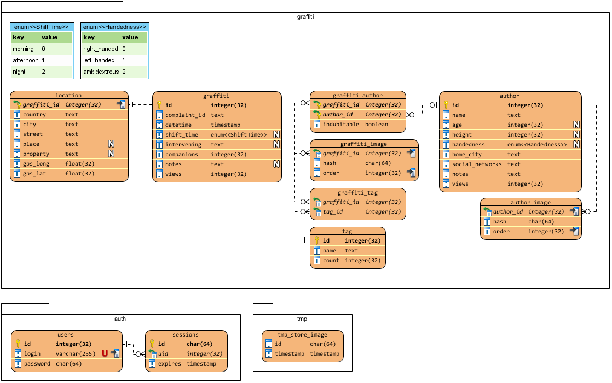
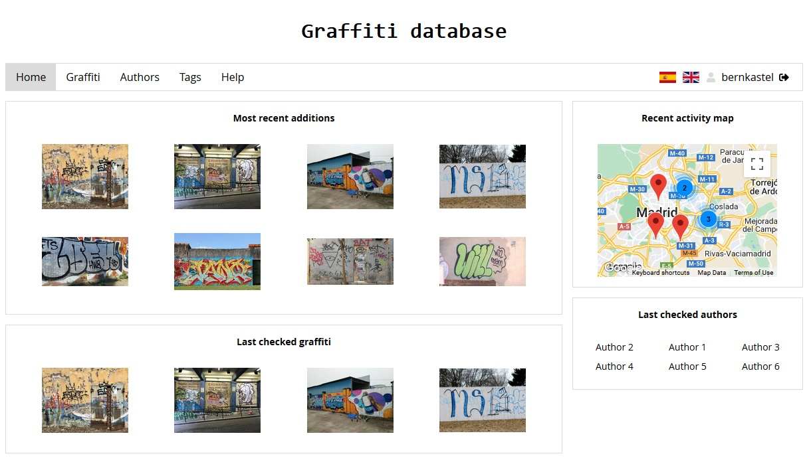

  
An experiment of building a web backend with Rust and Docker.

### Run yourself
```bash
# compile (requires nightly toolchain)
cargo build --release
mv target/release/lambda deploy/lambda

# register new admin user (cli)
cd deploy && ./lambda register -u "user" -p "password"

# run server
./lambda
# login at http://127.0.0.1:8080/views/login
```
For running with docker, see [`readme.Docker.md`](readme.Docker.md).

### Database ERD


### Screenshots
`- Homepage`


`- Graffiti page`


`- Graffiti edit`


`- Author page`


`- Advanced graffiti search`


`- Backend error reporting`

